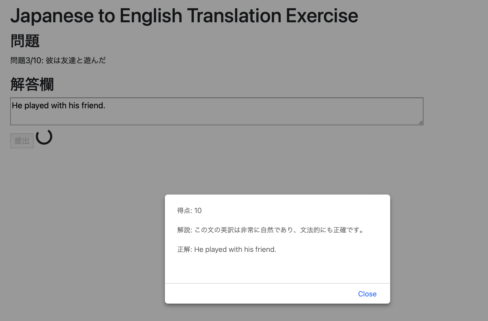

# SonoE
Japanese to English Writing exercise program using ChatGPT and Google Apps.
This system is 80% written by ChatGPT4.

# install
1. install clasp( https://github.com/google/clasp )
2. add consts.gs
```
const API_KEY = '(OpenAI API key)';
const SHEET_URL = '(Result Google SpreadSheet URL)';
```
3. Create Google Apps Web Application.
4. push to the Google Apps
   ```
   clasp push
   ```
5. Deploy as usual Google Apps Web Application

# Description
* 10 new Japanese to English translation problems are generated.
* It shows question one by one.


* On submit answer, score them (0-10) by ChatGPT and show its evaluation in Japanese.
* The scores and questions are recorded in a google SpreadSheet.
* If there are questions whose score < 10 and older than 2 weeks, pick up to 5 such questions randomly and ask.


